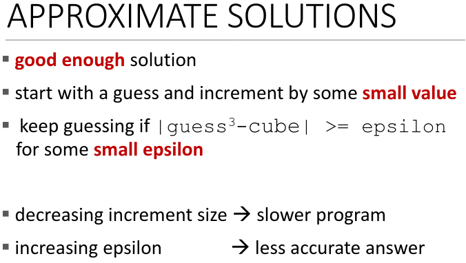
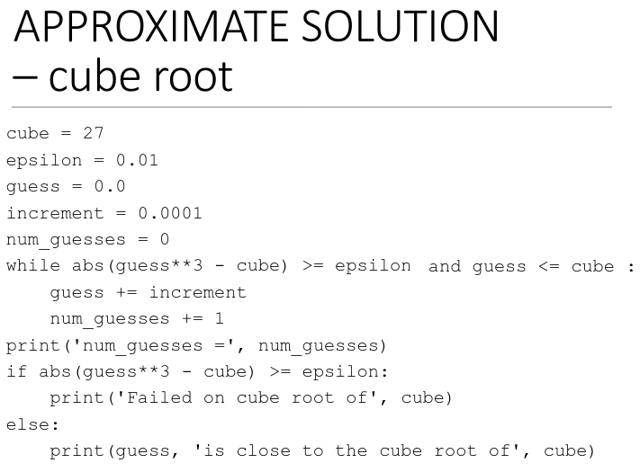
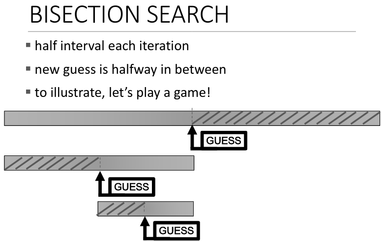
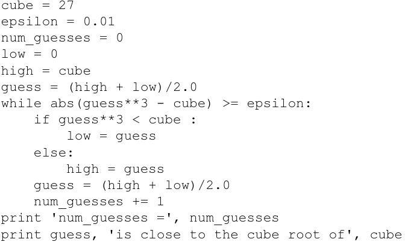
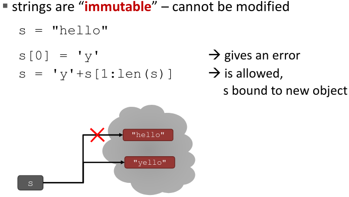
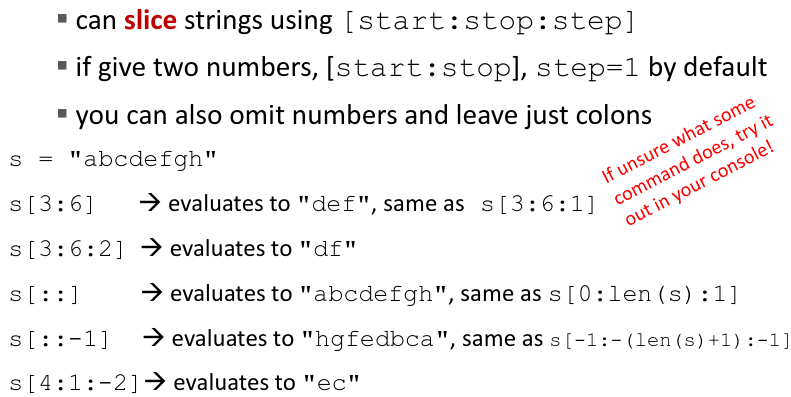
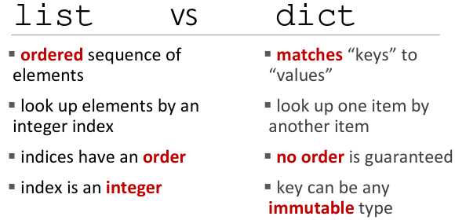
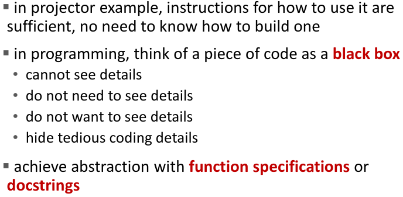
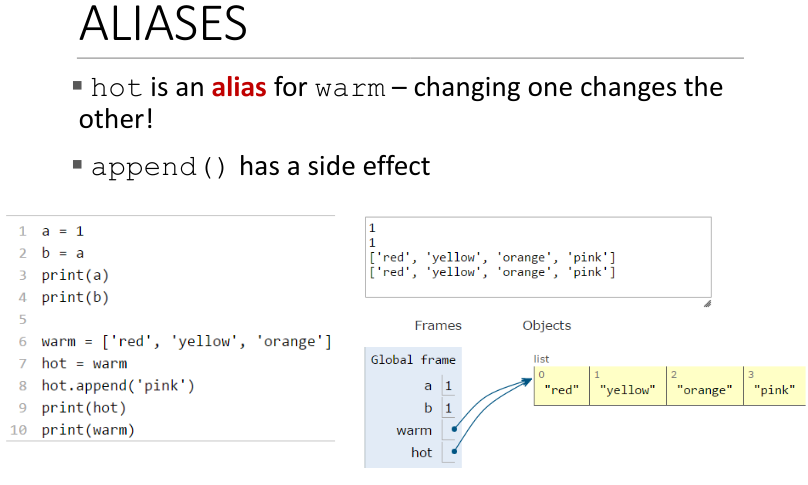
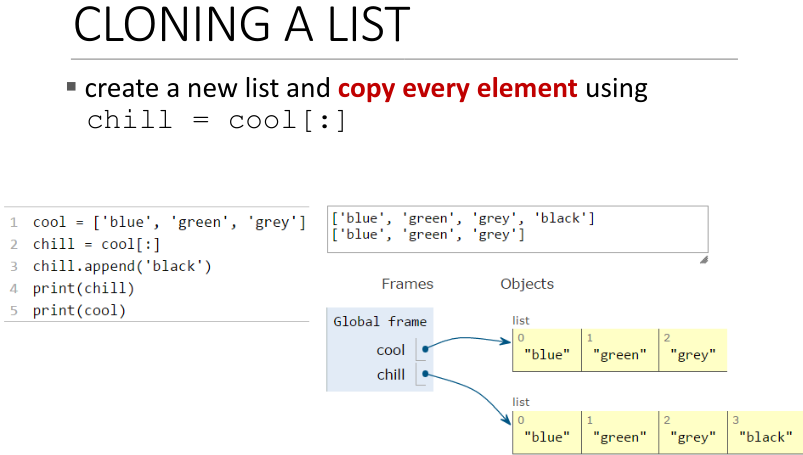

\maketitle
\tableofcontents
\newpage

# Zwei Arten von Wissen

## Deklaratives Wissen

Deklaratives Wissen sind Fakten. Deklaratives Wissen wird auch Sachwissen 
genannt, es ist also das Wissen über Sachverhältnisse.

## Prozedurales Wissen

Ist das Wissen über Handlungsabläufe z.B. Schnürsenkel binden. 
Es ist das Wissen was wir den Computern beibringen.

# Algorithmen

*Was ist ein Algorithmus?*

1. ist eine folge von simplen Schritten
2. *flow control* ein spezifizierung wann die Schritte ausgeführt werden
3. ein Weise herauszufinden wann der Algorithmus beendet werden soll

## Arten von Algorithmen

### Approximate Solution Algorithm

In dem Approximate Solution Algorithmus wird eine Vermutung aufgestellt und erhöht. 
(bis man an dem Ergebniss nah genug dran ist oder dran vorbei ist).

Bei einem Algorithmus was die Kubikwurzel von n ermitteln soll rät es von 0 bis 
n, das Programm erhöht die Vermutung solange bis $(guess^3 - n) >= \epsilon$ 
(epsilon ist je nach genauigkeit anders, genau wie die Zahl, 
die benutzt wird um die Vermutung zu erhöhen).

Das Programm scheitert wenn n keine perfekte Kubikwurzel ist und die Vermutung > n ist.

### Bisection search

Bei Bisection wird eine Vermutung in der Mitte von dem Minimum und dem Maximum gestellt,
dann wird geprüft ob das Ergebniss höher oder niedriger als die Vermutung ist und 
dann fängt das ganze wieder von vorne an, bis das Ergebniss nah genug dran ist.

# Zwei Arten von Computer

## Fixed Program Computer

Ein Beispiel für ein Fixed Program Computer ist ein Taschenrechner wo man keine
möglichkeit hat eine Befehl abfolge zu speichern.

## Stored Program Computer

Ist eine Maschine die Befehle speichern und sie ausführen kann. Man kann also 
mehrere Sachen machen mit einer Maschine im gegensatz zu dem Fixed Program Computer.

# Wie funktioniert ein Computer

Ein Computer befolgt genau die Befehle die im gegeben werden nicht mehr und nicht weniger.

Ein Computer hat eine Reihe von vorher definierten primitiven Anweisungen. 
(Rechnen und Logik, simple Tests und Daten bewegen)
Und der interpreter führt die Befehle des Programms der Reihe nach aus 
(mit flowcontrol) und stoppt wenn das Programm fertig ist.

## Basic Machine Architecture

Die CPU bekommt Befehle vom Arbeitsspeicher diese Befehle sendet er zum ALU 
(**A**rithmetic **L**ogic **U**nit) die ALU bearbeitet den Befehl 
und der program counter erhöht sich um eins.
Das geht so lange weiter bis das Programm fertig gelaufen ist und vielleicht ein 
output ausgibt.

Es kann aber auch sein, dass das Programm ein Test abfragt, 
dieser Test (der Test kann entweder True oder False ergeben) wird in der ALU 
bearbeitet je nach Ergebniss kann ein anderer Arbeitsschritt von dem Programm 
gefordert werden.

## Basic Primitives

Mit den sechs Primitiven kann man alles berechnen, dass heißt alles was ich 
in einer Programmiersprache programmieren kann, 
kann ich auch in einer anderen Programmiersprachen programmieren.

1. move left
2. move right
3. read
4. write
5. scan
6. do nothing

Programmiersprachen sorgen dafür das man nicht nur in den sechs primitiven 
Anweisungen programmieren muss.

# Data types

## Strings

### Immutable

Strings sind in vielen Programmiersprachen 
(Java, C#, JavaScript, Python und Go...) Immutable, das heißt, 
dass man sie nicht ändern kann und sie neu assignen muss.

### Slicing

Slicing ist wenn man ein start index angibt und ein end index. 
[start:stop:step] Man kann auch die anzahl der Schritte angeben.

## compound data types

compound data types sind all die data types, die andere data types beinhalten können, 
wie Lists oder Tuples.

## Unterschied zwischen Lists und Tuples

Der einzige Unterschied zwischen Lists und Tuples ist, dass Lists mutable sind 
und Tuples nicht.

Tuples können nützlich sein, wenn man mehrere Werte in einer function return 
will oder wenn man zwei Variable tauschen will $(y, x) = (x, y)$.

## Lists vs Dictionaries

# Programmierkonzepte

## Decomposition (Zerlegung)

Es ist wichtig dein Code in mehrere wiederverwendbare Module zu zerlegen, 
um dein Code verständlicher, strukurierter und übersichtlicher zu machen, 
das ist möglich mit functions.

Functions sind miniprogramme in deinem Hauptprogramm, functions haben einen Namen, 
Parameter, vielleicht auch docstrings und können etwas return.

Die Namen der functions sollten beschreiben was sie tuhen, damit dein Code 
verständlicher ist.
Ein docstrings ist ein Kommentar in der function die beschreibt was die function 
tut und wie man sie benutzt.

## Abstraction (Abstraktion)

Abstraktion ist die Idee, details zu verstecken, man interessiert sich nur dafür, 
was der output und input ist, wie man es benutzt und was es tut.

Du musst nicht wissen wie etwas gebaut ist, um es zu benutzen. (Blackbox)

# Mutability side effects

Wenn mehrere Variable auf einen Wert zeigen und der Wert sich ändert, 
ändern sich auch die Werte auf die, die Variable zeigen.

Wenn mehrere Variable auf einen Wert zeigen nennt man das aliasing.

Um dies zu verhindern kann man einen Wert klonen und somit eine Kopie von einem 
Wert erstellen.

# Recursion

Recursion ist wenn man eine function in sich selbst ruft.

Bei Recursion nimmt man ein Problem und vereinfacht es. 

# Defensive Programming

