\maketitle
\tableofcontents
\newpage

# Warum sollte man Programmieren lernen?

Computer sind geschaffen um auf uns Menschen zu hören, sie warten auf Befehle und führen sie dann aus.
Wenn man ein Smartphone startet macht es nichts, solange wir keine Befehle geben.
Dieses Smartphone wurde von Software entwicklern Programmiert.

Um unseren Computern besser Befehle geben zu können müssen wir ihre Sprache lernen.

Programmierer zu werden hat viele Vorteile:

- man kann repetitive Aufgaben automatisieren
- man arbeitet mit seinem Kopf und muss sich somit nicht Körperlich anstrengen
- wir können neue Werkzeuge erschaffen und der Welt unser ergebniss zeigen
- man kann von überall wo man ein Computer hat arbeiten
- man kann immer mehr dazu lernen (man lernt nie aus)
- man kann sich kreativ ausleben

Man kann entweder Programme für sich selbst schreiben oder für andere Nutzer als Beruf.

## Was ist Code

Code ist eine Sammlung von Befehlen die von oben nach unten abgearbeitet werden.

## Menschen vs Computer

Computer nehmen Befehle sehr wörtlich, dass heißt das es schon bei kleinen Rechtschreib fehler zu Problemen kommen kann, was bei Menschen nicht der Fall ist.

Computer sind im gegensatz zu Menschen sehr gut darin Daten in kurzer Zeit zu verarbeiten.

# Hardware

Ein Computer ist unterteilt in Hardware und Software allgemein lässt sich sagen das Hardware alles das an einem Computer ist was man anfassen kann und Software ist alles das was man nicht anfassen kann.

Man kann Hardware noch in weiteren Gruppen Unterteilen:

- Eingabe und Ausgabe Geräte
  - Monitor, Maus, Lautsprecher oder Tastatur

- CPU (Central Processing Unit)
  - führt sehr schnell Befehle aus und fragt was sie als nächstes machen soll

- Hauptspeicher (Main Memory)
  - gibt der CPU Befehle, ist ein schneller temporärer Speicher (vergisst alles nach einem reboot)

- Sekundärerspeicher
  - SSD oder HDD speichert Daten und ist langsamer als der Hauptspeicher (die Daten halten solange bis man sie löscht)

Deine Aufgabe ist es code zu schreiben um der CPU Befehle zu geben. Du schreibst dein Code in einer Datei in den Sekundärenspeicher, der Code wird dann in Binärcode umgewandelt (0 und 1) und auf den Hauptspeicher übertragen von wo die CPU Befehle bekommt.

\newpage

# Mit Dateien Programmieren

Wenn wir mit Dateien Programmieren ermöglicht es uns etwas Permanentes zu erschaffen.

Wenn wir in einem Programm eine Datei öffnen, öffnen wir nicht den Text in der Datei, sondern erstellen einen *Filehandler*, dieser *Filehandler* ermöglicht es uns mit der Datei zu interagieren (die Datei zu lesen, Text in der Datei zu schreiben...).

# Regex

Regex Erklärung: 
<https://automatetheboringstuff.com/2e/chapter7/>

Regex ist eine kleine Programmiersprache, die anstatt von Zeile zu Zeile von Zeichen zu Zeichen abläuft.
Die Sprache wird benutzt um bestimmte Begriffe in einem Text herauszufiltern.

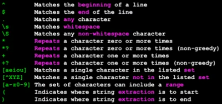

## [Gierig](Gierig) und nicht gierig

Der unterschied zwischen gierig und nicht gierig bei Regex ist, dass es im gierigen Modusl (wenn es die Wahl hat) die längste passende Zeichenfolge nimmt. Bei dem nicht gierigem Modus nimmt es nicht die längste sonder die kürzeste passende Zeichenfolge. 

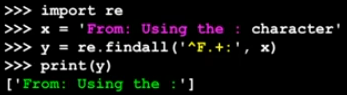

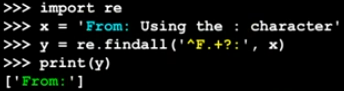

# Netzwerk Programmierung

## Sockets

Ein Socket ist eine Verbindung zwischen zwei Prozessen über das Internet. Die Prozesse kommunizieren miteinander und tauschen Daten aus.

## Port

Ein Port erlaubt es mehrere Web-Applikationen auf einen Webserver zu haben. Um eine bestimmte Applikation aufzurufen gibt man die Portnummer ein.
Man kann sagen, dass ein Port wie eine Telefonverlängerung ist.

## Was ist ein Protokoll

Ist eine Sammlung von Regeln (Regelwerk), an die sich jedes Mitglied halten muss, damit man das Verhalten der anderen Teilnehmer vorhesehen kann.

## HTTP Protokoll

HTTP steht für Hypertext Transfer Protocol und ist das Protokoll was für Webserver benutzt wird um Dateien wie Bilder HTML (Hypertext Markup Language), Dokumente usw. abzurufen.

## Ein sehr simpler Web-Browser in Python 

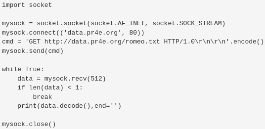

1. als erstes erstelle ich mein socket *mysock*
2. dann erstelle ich eine Verbindung zum webserver auf dem Port 80 *mysock.connect*
3. dann erstelle ich ein befehl der nach romeo.txt fragt und es encoded (bereitet die daten vor durch das Internet zu gehen) *cmd*
4. danach sende ich den Befehl über mein vorher erstellten Socket *mysock.send()*
5. anschließend frage ich nach 512 Zeichen pro Wiederholung und schreibe die daten dann in stdout *print(data.decode(),end='')*
6. ich ende das Programm wenn *data* weniger als 1 Zeichen enthält *if len(data) < 1: break*

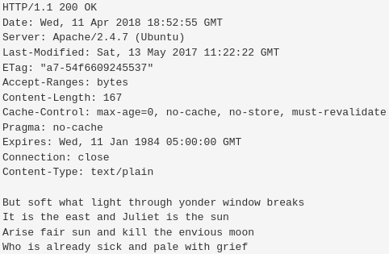

Der output von diesem Beispiel zeigt uns zuerst die Metadata von der Datei (headers). 
Und dann den Inhalt der Datei.

## Zeichen, ASCII und Unicode

### ASCII

ASCII steht für **A**merican **S**tandard for **I**nformation **I**nterchange und ordnet jedem Buchstaben eine Zahl zu, in Form von 8 bits (einem Byte).

Es gibt 128 Zeichen in ASCII bei der 7-Bit-Codierung $2^7=128$ und 256 bei der 8-Bit-Codierung $2^8=256$. (Ein Bit kann entweder aus (0) oder an (1) sein)

Das Problem mit ASCII ist das es einfach zu wenig Zeichen gibt.

### Unicode

Unicode ist ein character set wie ASCII und umfasst mehrere Milliarden Zeichen.

Ohne Encodings währe Unicode viel zu Groß um es um das Internet zu schicken.

- UTF-32 - 4 Bytes
- UTF-16 - 2 Bytes
- UTF-8 - 1-4 Bytes

**UTF-8** ist der Standard, weil es kompatibel mit ASCII ist und nicht so groß wie die anderen encodings ist.

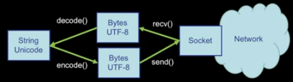

Das Netzwerk hat Daten die in UTF-8 encoded sind (Bytes) wir müssen unser Befehl auch in UTF-8 senden.
Dann recv() empfangen wir die Daten, aber müssen sie noch von UTF-8 decoden.

### Web Scraping

Web Scraping ist wenn ein Script oder ein Programm Information aus einer Webseite extrahiert. Es ist das gleiche was Suchmaschinen wie Google machen.

# Verwendung von Webservices

Um Daten über das Internet von verschiedenen Programmen zu verschicken gibt es das **Wire Protokoll** es ist wie eine Vereinbarung wie Daten verschickt werden sollen.

Ein Wire Format ist zum Beispiel JSON oder XML.

Wir senden zum Beispiel Daten von einem Python Programm zu einem JavaScript Programm in dem wir die Daten in XML Serialisieren und das JavaScript Programm muss die Daten dann Deserialisieren.

**Serialisieren und Deserialisieren** ist wenn ein Programm Daten in ein bestimmtes Format konvertiert, sodass ein anderes Programm es einfacher lesen kann.

## XML

XML steht für e**X**tensible **M**arkup **L**anguage es wird benutzt um Daten zu Strukturieren.

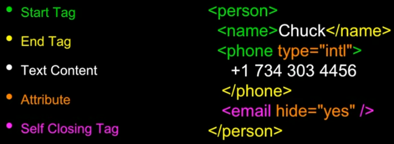

Eine XML Datei besteht aus tags (geben Anfang und Ende eines Elements an) und Attribute (Schlüsselwort und Wert Paar).

### XML Schema

Ein XML Schema ermöglicht es uns zu Definieren, was richtiges XML ist und was nicht.
Wir prüfen eine XML Datei mit einem Validator Programm welches das Schema und die Datei vergleicht.

Eine Beliebte XML Schema sprache ist XSD.

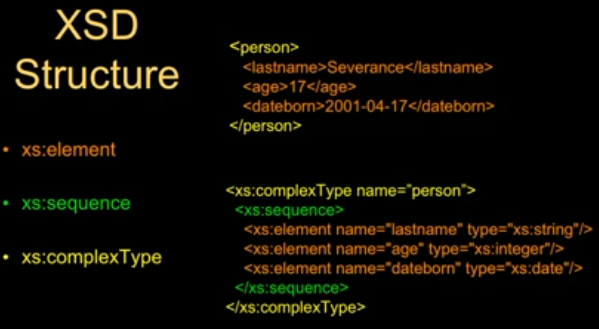

## JSON

JSON steht für **J**ava**S**cript **O**bject **N**otation und ist beliebter als XML weil es simpler und somit auch einfacher ist als XML.

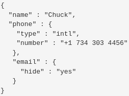

Wir ordnen jeden Schlüsselwert einem Wert zu z.B. Name: "Chuck". Wir initialisieren ein Dictionary mit {} und eine Liste mit []. Es gibt keine Attribute wie in dem XML Datei Format.

## SOA - Service Oriented Architecture

Anstatt ein Service für alles zu benutzen teilen wir bei SOA verschiede Aufgaben über verschiedene Service auf.
Die Services kommunizieren miteinander und teilen Daten.

Ein gutes Beispiel dafür ist eine Reisewebsite wo ein Service z.B. für Kreditkarten ist und ein anderer Service von einer anderen Applikation für das Hotel reservieren System zuständig ist.
Was die Reisewebsite tut ist, sie kommuniziert mit all diesen verschiedenen Services rund um das Internet um uns eine Reise zu buchen.

## API - Application Program Interface

Ein API ist eine Benutzeroberfläche die auf eine individuell definierte Weise Daten übermittelt, wenn man die API richtig benutzt.

Es hängt von dem API ersteller ab, wie man die API benutzt, dass heißt das man die Dokumentation der API lesen und verstehen muss um sie zu benutzen.

# OOP - Object Oriented Programming

OOP ist die unterteilung von Code in verschiedene Objekte.
Ein Objekt ist ein bisschen code.

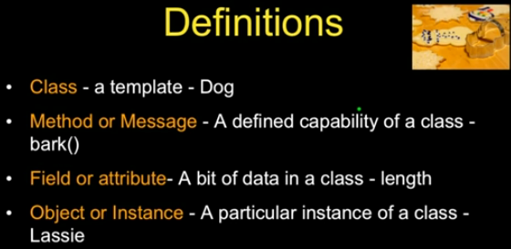

Es gibt Klassen die, die Charakteristischen Eigenschaften eine Objektes beschreiben. (z.B. bei der Klasse "Hund" wird definiert das es Fell hat).
Man kann Methods in einer Klasse schreiben was wie eine function in der Klasse ist (z.B. Bellen).
Dann gibt es noch Attribute die Variablen in einer Klasse sind.

## Inheritance

Inheritance ist wenn man eine Klasse erweitert indem man eine neue Klasse in der bereits existierenden Klasse erstellt (z.B. Parentclass = Hund, Childclass = Mops).
Dieser Mops in unseren Beispiel hat all die Eigenschaften der Hunde Klasse.

# Datenbanken

Eine Datenbank ist eine organisierte Sammlung von strukturierten Informationen oder Daten.

Es gibt verschieden Datenbankprogrammiersprachen, die dazu da sind zu sagen welche Daten du haben willst, oder um Daten in der Datenbank zu modifizieren. (Create data, retrieve data, update data, delete data)
Ein Beispiel für eine Datenbankprogrammiersprachen ist SQLite.

**SQL** Steht für **S**tructured **Q**uery **L**anguage.

Wir als Programmierer kriegen Daten aus einer externen Quelle, modifizieren die Daten, sodass sie nur das beinhalten was wir wollen.
Danach schreiben wir die Daten in die Datenbank und können die Daten aus der Datenbank dann für ein anderes Programm nutzen.

Bei einem großen Projekt programmiert der Software Entwickler die Applikation (die Logik oder das aussehen) und der **DBA** (**D**ata**b**ase **A**dministrator) beobachtet und passt die Datenbank an.

## Database Models

Datenbanken sind erst richtig mächtig wenn man mehrere Tables benutzt.

Bei Datenbanken sollte man darauf achten das es keine Duplikation von Werten gibt.
Überall da wo es Duplikation geben kann erstellen wir ein neues Table.

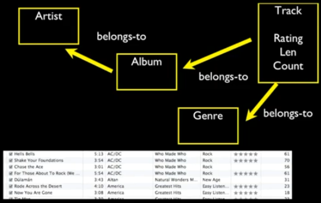

## SQL

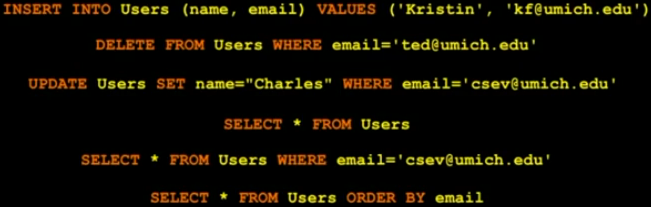

In dem Beispiel fügen wir ein Nutzer zu der 'Users' table mit dem befehl *INSERT*. Wir erstellen ein Table mit dem Namen 'Users' und den Werten name und email die beides TEXT sind mit dem befehl *CREATE TABLE "Users" ("name" TEXT, "email" TEXT)*.

Um Daten anzuzeigen nutzen wir den Behfehl *SELECT*, wir können die Daten nach einem bestimmten Wert ordnen z.B. email.

Mit dem Behfehl *WHERE* können wir nur die Werte auswählen wo der bestimmte Wert zutrifft.

Ein Cursor ist wie ein Filehandler, mit dem wir Operationen an den in der Datenbank gespeicherten Daten ausführen können.

SQL cheatsheet:
<https://www.sqltutorial.org/sql-cheat-sheet/>

Python Beispiele: 
<https://www.py4e.com/html3/15-database>

### Referencing

Um Daten von einem Table zu einem anderen zu benutzen, benutzen wir keys.
Es gibt verschiedene Arten von keys, den Primärenkey eine Zahl die der Logicalkey zugeordnet wird und der Foreignkey ist ein der auf einer row in einem anderem Table zeigt.

Man sollte nie den Logicalkey als Primärenkey benutzen, weil der Logicalkey sich ändern kann. (z.B. bei einer email Adresse)

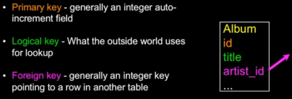

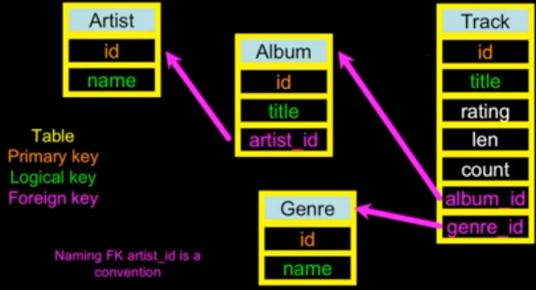

### JOIN

*JOIN* ermöglicht es uns die Tables miteinander zu verbinden und Daten von vielen verschiedenen Datenbanken so anzuzeigen wie wir es wollen.

Wir können *JOIN* in kombination mit *ON* benutzen um mehrere Tables nur an bestimmten Stellen zu verbinden.

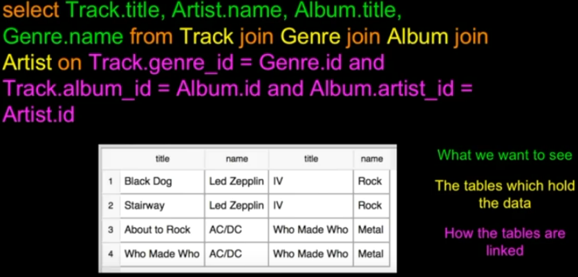

### Many-to-Many Relationship

In dem Beispiel zuvor ging es um ein One-to-Many Relationship bei dem ein Album ein Author zugeordnet werden kann und bei dem Many-to-Many Relationship kann z.B. zu einem Kunden mehrere Bestellungen zugeordnet werden oder einem Kurs mehrere Teilnehmer.

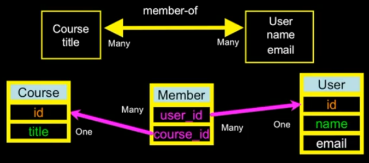
